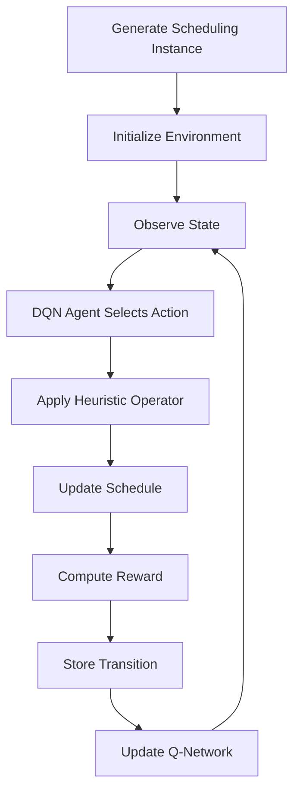
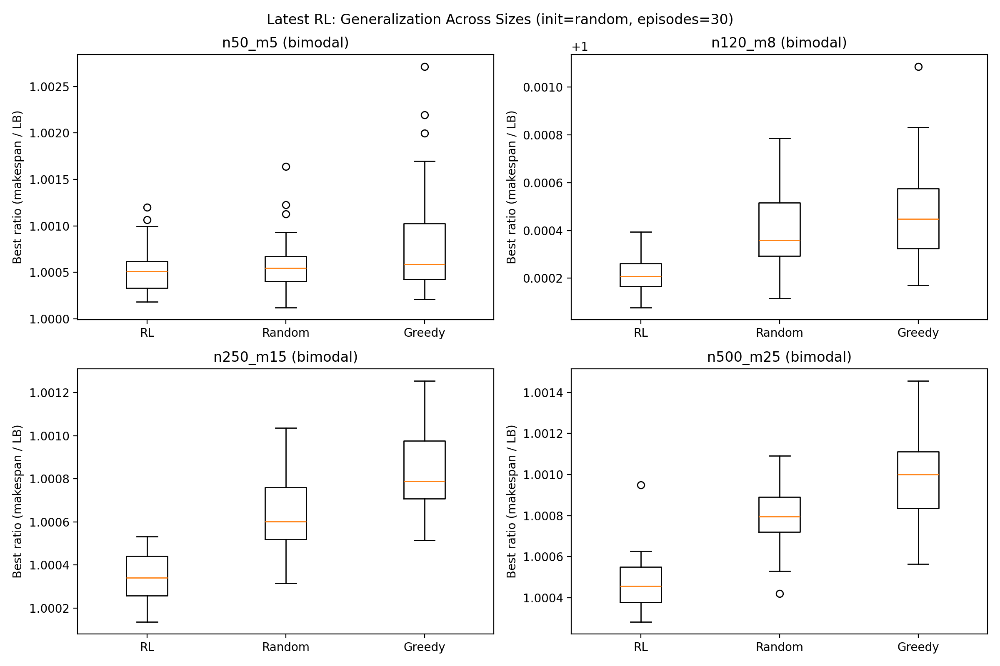
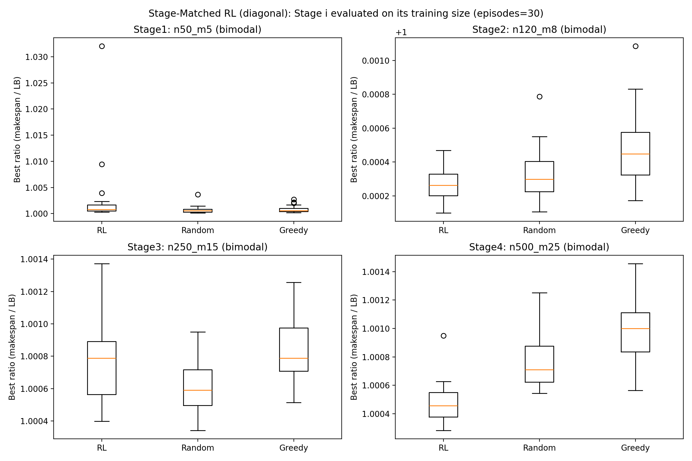

# RL Hyper-Heuristic for Identical Parallel Machine Scheduling


---

# Overview

This repository implements a **Reinforcement Learning (RL) based Hyper-Heuristic** for solving the **Identical Parallel Machine Scheduling Problem ($P||C_{max}$)**.

Instead of designing a single handcrafted heuristic, the system **learns how to dynamically select low-level heuristics** using reinforcement learning. The RL agent learns a **policy over heuristic operators** that modify schedules to reduce makespan.

The project integrates:

- Reinforcement Learning (Deep Q-Network)
- Hyper-Heuristics
- Classical scheduling algorithms
- Experimental benchmarking

Built using:

- PyTorch
- Stable-Baselines3
- Gymnasium
- NumPy
- Pandas
- Matplotlib
- TensorBoard

---

# Scheduling Problem

Let's consider the **Identical Parallel Machine Scheduling Problem**.

Given:

- $n$ jobs
- $m$ identical machines
- processing time $p_j$ for job $j$

The goal is to assign jobs to machines such that the **makespan is minimized**.

$$
C_{max} = \max_{i \in \{1,...,m\}} C_i
$$

where

$$
C_i = \sum_{j \in J_i} p_j
$$

and $J_i$ is the set of jobs assigned to machine $i$.

This problem is **NP-hard for $m \ge 2$**.

---

# Lower Bounds

Theoretical bounds are used to evaluate schedule quality.

Total processing time:

$$
P = \sum_{j=1}^{n} p_j
$$

## Load balancing bound:

$$
LB_1 = \frac{P}{m}
$$

## Largest job bound:

$$
LB_2 = \max_j p_j
$$

## Final lower bound:

$$
LB = \max(LB_1, LB_2)
$$

Optimality gap:

$$
Gap = \frac{C_{max} - LB}{LB}
$$

---

# Constructive Heuristics

Initial schedules are generated using classical scheduling heuristics.

## List Scheduling

Assign each job to the **least loaded machine**.

$$
machine = \arg\min_i load_i
$$

---

## Longest Processing Time (LPT)

Jobs sorted:

$$
p_1 \ge p_2 \ge ... \ge p_n
$$

Then scheduled using list scheduling.

Worst-case bound:

$$
C_{max} \le (4/3 - 1/(3m))OPT
$$

---

# Heuristic Operators

Low-level heuristics modify schedules.

Examples:

- Job swap
- Job relocation
- Load balancing
- Machine reassignment

Pseudo-code:

```
Algorithm ApplyOperator(schedule S, operator op)

if op == SWAP:
    choose jobs i,j
    swap machines

if op == RELOCATE:
    move job i to new machine

if op == BALANCE:
    move job from heaviest machine
    to lightest machine

return updated schedule
```

---

# Hyper-Heuristic Framework

A **Hyper-Heuristic (HH)** operates at a higher level than standard heuristics. Instead of directly constructing schedules, it **selects among heuristics**.

Workflow:


The RL agent learns a policy over heuristic operators that iteratively improve schedules.

---

# Reinforcement Learning Formulation

The scheduling improvement process is modeled as a **Markov Decision Process (MDP)**.

## State

State features include:

- machine loads
- load imbalance
- current makespan
- lower bound ratio
- remaining jobs

Example state vector:

$$
s = [load_1, load_2, ..., load_m, C_{max}, LB, imbalance, remaining]
$$

---

## Actions

Each action corresponds to a **low-level heuristic operator**.

$$
a \in \{swap, relocate, balance, reassign\}
$$

---

## Reward

Reward reflects improvement in makespan:

$$
r_t = C_{max}^{old} - C_{max}^{new}
$$

Positive reward indicates schedule improvement.

---

# Reinforcement Learning Algorithm: Deep Q-Network (DQN)

The RL agent is trained using a **Deep Q-Network (DQN)** to approximate the action-value function.

Update rule:

$$
Q(s,a) \leftarrow Q(s,a) + \alpha \left(r + \gamma \max_{a'} Q(s',a') - Q(s,a)\right)
$$

The neural network approximates the Q-function:

$$
Q(s,a; \theta)
$$

where $\theta$ represents the neural network parameters.

Where:

- $s$ -- current state  
- $a$ -- selected action (heuristic operator)  
- $r$ -- reward obtained after applying the operator  
- $\gamma$ -- discount factor  
- $\alpha$ -- learning rate  
- $\theta$ -- neural network parameters

---

# Environment

Custom Gymnasium environment:

```
src/rl_hh/env/sched_identical_env.py
```

Implements:

```
step()
reset()
reward()
termination()
```

---

# Training Workflow



---

# Hyper-Heuristic Algorithm

```
Algorithm RL Hyper-Heuristic

Initialize RL agent
Generate scheduling instance
Construct initial schedule

for episode:
    observe state s
    select operator a
    apply operator
    observe reward r
    update Q-network

return best schedule
```

---

# Example Schedule Visualization

Example schedule:

```
Machine 1: | J2 | J7 | J9 |
Machine 2: | J1 | J3 |
Machine 3: | J4 | J5 | J8 |
Machine 4: | J6 |
```

Gantt-style representation:

```mermaid
gantt
    title Example Schedule
    dateFormat X
    axisFormat %L

    section Machine 1
    J2 :0,5
    J7 :5,3
    J9 :8,2

    section Machine 2
    J1 :0,4
    J3 :4,4

    section Machine 3
    J4 :0,2
    J5 :2,6
    J8 :8,2
```



---

# Instance Generation

Instances generated using distributions.

### Uniform Distribution

$$
p_j \sim U(1,100)
$$

### Bimodal Distribution

Half small jobs:

$$
p_j \sim U(1,20)
$$

Half large jobs:

$$
p_j \sim U(50,100)
$$

### Heavy Tail

Lognormal distribution:

$$
p_j \sim LogNormal(\mu, \sigma)
$$

Implemented in:

```
vendor/identical_scheduling/instances.py
```

---

# Baselines

Two baselines are implemented.

### Random Hyper-Heuristic

Randomly selects operators.

```
baselines/random_hh.py
```

### Greedy Hyper-Heuristic

Selects the best immediate operator.

```
baselines/greedy_hh.py
```

---

# Project Structure

```
src/
 └── rl_hh/
     ├── env/
     ├── heuristics/
     ├── baselines/
     ├── rl/
     ├── utils/
     └── vendor/
         └── identical_scheduling/

experiments/
    train_agent.py
    evaluate.py

results/
    evaluation csv files
    plots
    tensorboard logs
```

---

# Installation

Create environment:

```
conda env create -f environment.yml
conda activate hh-env
```

Install additional packages:

```
pip install -e .
pip install -r requirements.txt

```

---

# Training

Train RL agent:

```
python experiments/train_agent.py
```

This trains a DQN agent using Stable-Baselines3.

Training artifacts:

```
results/
    models
    tensorboard logs
```

---

# Evaluation

Run evaluation:

```
python experiments/evaluate.py
```

Outputs:

- CSV summaries
- operator usage statistics
- evaluation plots

---

# Results

Experiments conducted on multiple instance sizes.

| Jobs | Machines |
|-----|-----|
| 50 | 5 |
| 120 | 8 |
| 250 | 15 |
| 500 | 25 |

Findings:

- RL hyper-heuristic significantly outperforms the random baseline  
- Performance is competitive with the greedy hyper-heuristic  
- Learned policies generalize across larger problem sizes

---

# Figures

## Generalization Results



## Stage Matched Results



---

# Reproducing Results

Step 1

```
python experiments/train_agent.py
```

Step 2

```
python experiments/evaluate.py
```

Step 3

Inspect results:

```
results/*.csv
results/*.png
```

---

# TensorBoard

Run:

```
tensorboard --logdir results/tb
```

Open:

```
http://localhost:6006
```

---

# Key Takeaways

This project demonstrates:

- Reinforcement learning based hyper-heuristics
- Integration with classical scheduling heuristics
- Scalable experimentation pipeline
- Generalization across scheduling scales

---

# Future Work

Possible extensions:
- Integrate a quantum-enhanced heuristic operator (QAOA-based) into the RL hyper-heuristic operator set.
- multi-objective scheduling
- adaptive operator sets
- meta-learning across distributions

---

# References

The mathematical formulations and concepts used in this project are based on established work in scheduling theory, hyper-heuristics, and reinforcement learning.

1. **Scheduling Theory**

   Michael Pinedo.  
   *Scheduling: Theory, Algorithms, and Systems*.  
   Springer, 5th Edition, 2016.

2. **Parallel Machine Scheduling**

   Ronald L. Graham.  
   "Bounds on multiprocessing timing anomalies."  
   *SIAM Journal on Applied Mathematics*, 17(2), 416-429, 1969.

3. **Longest Processing Time (LPT) Rule**

   Ronald L. Graham.  
   "Bounds for Certain Multiprocessing Anomalies."  
   *Bell System Technical Journal*, 45(9), 1563–1581, 1966.

4. **Hyper-Heuristics**

   Edmund K. Burke, Michel Gendreau, Matthew Hyde, Graham Kendall, Gabriela Ochoa, Ender Özcan, and Rong Qu.  
   "Hyper-heuristics: A survey of the state of the art."  
   *Journal of the Operational Research Society*, 64(12), 1695–1724, 2013.

5. **Hyper-Heuristics for Combinatorial Optimization**

   Edmund K. Burke, Graham Kendall.  
   *Search Methodologies: Introductory Tutorials in Optimization and Decision Support Techniques*.  
   Springer, 2014.

6. **Reinforcement Learning Foundations**

   Richard S. Sutton and Andrew G. Barto.  
   *Reinforcement Learning: An Introduction*.  
   MIT Press, Second Edition, 2018.

7. **Q-Learning**

   Christopher J. C. H. Watkins and Peter Dayan.  
   "Q-learning."  
   *Machine Learning*, 8, 279–292, 1992.

8. **Deep Q-Networks**

   Volodymyr Mnih et al.  
   "Human-level control through deep reinforcement learning."  
   *Nature*, 518, 529–533, 2015.

9. **Reinforcement Learning for Combinatorial Optimization**

   Irwan Bello et al.  
   "Neural Combinatorial Optimization with Reinforcement Learning."  
   *International Conference on Learning Representations (ICLR)*, 2017.

10. **Reinforcement Learning Hyper-Heuristics**

   Ender Özcan, Mustafa Misir, Gabriela Ochoa, and Edmund Burke.  
   "A reinforcement learning approach to hyper-heuristics."  
   *European Journal of Operational Research*, 2010.
